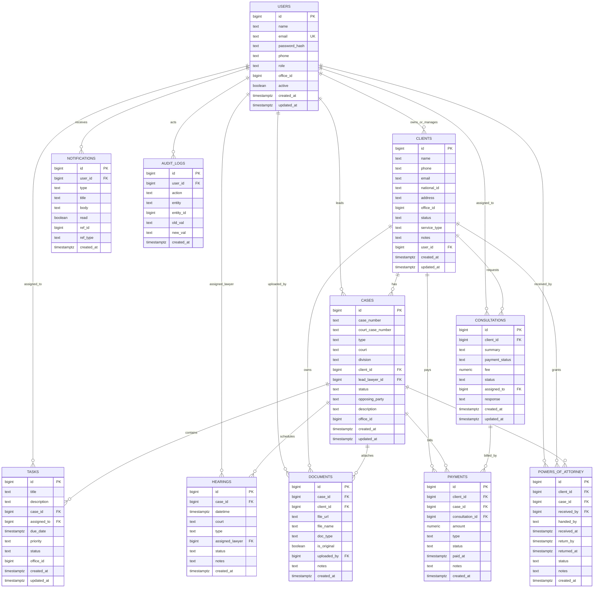
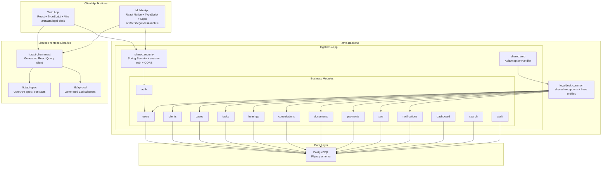
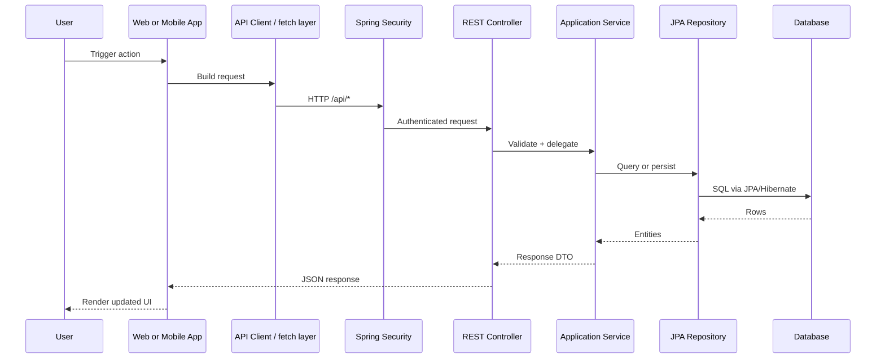

# LegalDesk System Diagrams

This document is based on the current active codebase:

- `artifacts/api-server-java`
- `artifacts/legal-desk`
- `artifacts/legal-desk-mobile`
- `lib`

It contains:

1. ERD
2. Class Diagram
3. Architecture Diagram

## ERD

Source of truth:

- `artifacts/api-server-java/legaldesk-app/src/main/resources/db/migration/V1__init_schema.sql`

## Class Diagram

This class diagram focuses on the backend module pattern and the most important domain classes rather than every DTO.

```mermaid
classDiagram
    class LegalDeskApplication
    class SecurityConfig
    class ApiExceptionHandler

    class BaseEntity {
      +Long id
    }

    class AuditedEntity {
      +OffsetDateTime createdAt
      +OffsetDateTime updatedAt
    }

    BaseEntity <|-- AuditedEntity

    class UserEntity {
      +String name
      +String email
      +String passwordHash
      +String role
      +Boolean active
    }

    class ClientEntity {
      +String name
      +String phone
      +String email
      +String status
      +String serviceType
    }

    class CaseEntity {
      +String caseNumber
      +String type
      +String court
      +String status
    }

    class TaskEntity {
      +String title
      +String priority
      +String status
      +OffsetDateTime dueDate
    }

    class HearingEntity {
      +OffsetDateTime datetime
      +String court
      +String type
      +String status
    }

    class ConsultationEntity {
      +String summary
      +String paymentStatus
      +BigDecimal fee
      +String status
    }

    class PaymentEntity {
      +BigDecimal amount
      +String type
      +String status
      +OffsetDateTime paidAt
    }

    class DocumentEntity {
      +String fileName
      +String fileUrl
      +String docType
      +Boolean isOriginal
    }

    class PowerOfAttorneyEntity {
      +String handedBy
      +OffsetDateTime receivedAt
      +OffsetDateTime returnedAt
      +String status
    }

    class NotificationEntity {
      +String type
      +String title
      +String body
      +Boolean read
    }

    class AuditLogEntity {
      +String action
      +String entity
      +Long entityId
    }

    AuditedEntity <|-- UserEntity
    AuditedEntity <|-- ClientEntity
    AuditedEntity <|-- CaseEntity
    AuditedEntity <|-- TaskEntity
    BaseEntity <|-- HearingEntity
    AuditedEntity <|-- ConsultationEntity
    BaseEntity <|-- PaymentEntity
    BaseEntity <|-- DocumentEntity
    BaseEntity <|-- PowerOfAttorneyEntity
    BaseEntity <|-- NotificationEntity
    BaseEntity <|-- AuditLogEntity

    class AuthController
    class AuthApplicationService
    AuthController --> AuthApplicationService

    class UserController
    class UserApplicationService
    class UserEntityRepository
    UserController --> UserApplicationService
    UserApplicationService --> UserEntityRepository
    UserApplicationService --> UserEntity

    class ClientController
    class ClientApplicationService
    class ClientEntityRepository
    ClientController --> ClientApplicationService
    ClientApplicationService --> ClientEntityRepository
    ClientApplicationService --> ClientEntity

    class CaseController
    class CaseApplicationService
    class CaseEntityRepository
    CaseController --> CaseApplicationService
    CaseApplicationService --> CaseEntityRepository
    CaseApplicationService --> CaseEntity
    CaseApplicationService --> ClientEntityRepository
    CaseApplicationService --> UserEntityRepository

    class TaskController
    class TaskApplicationService
    class TaskEntityRepository
    TaskController --> TaskApplicationService
    TaskApplicationService --> TaskEntityRepository
    TaskApplicationService --> CaseEntityRepository
    TaskApplicationService --> UserEntityRepository

    class HearingController
    class HearingApplicationService
    class HearingEntityRepository
    HearingController --> HearingApplicationService
    HearingApplicationService --> HearingEntityRepository
    HearingApplicationService --> CaseEntityRepository
    HearingApplicationService --> UserEntityRepository

    class ConsultationController
    class ConsultationApplicationService
    class ConsultationEntityRepository
    ConsultationController --> ConsultationApplicationService
    ConsultationApplicationService --> ConsultationEntityRepository
    ConsultationApplicationService --> ClientEntityRepository
    ConsultationApplicationService --> UserEntityRepository

    class PaymentController
    class PaymentApplicationService
    class PaymentEntityRepository
    PaymentController --> PaymentApplicationService
    PaymentApplicationService --> PaymentEntityRepository
    PaymentApplicationService --> ClientEntityRepository
    PaymentApplicationService --> CaseEntityRepository
    PaymentApplicationService --> ConsultationEntityRepository

    class DocumentController
    class DocumentApplicationService
    class DocumentEntityRepository
    DocumentController --> DocumentApplicationService
    DocumentApplicationService --> DocumentEntityRepository
    DocumentApplicationService --> CaseEntityRepository
    DocumentApplicationService --> ClientEntityRepository
    DocumentApplicationService --> UserEntityRepository

    class PowerOfAttorneyController
    class PowerOfAttorneyApplicationService
    class PowerOfAttorneyEntityRepository
    PowerOfAttorneyController --> PowerOfAttorneyApplicationService
    PowerOfAttorneyApplicationService --> PowerOfAttorneyEntityRepository
    PowerOfAttorneyApplicationService --> ClientEntityRepository
    PowerOfAttorneyApplicationService --> CaseEntityRepository
    PowerOfAttorneyApplicationService --> UserEntityRepository

    class NotificationController
    class NotificationApplicationService
    class NotificationEntityRepository
    NotificationController --> NotificationApplicationService
    NotificationApplicationService --> NotificationEntityRepository

    class DashboardController
    class DashboardQueryService
    DashboardController --> DashboardQueryService

    class SearchController
    class SearchQueryService
    SearchController --> SearchQueryService

    LegalDeskApplication --> SecurityConfig
    LegalDeskApplication --> ApiExceptionHandler
```

Primary code sources:

- `artifacts/api-server-java/legaldesk-common/src/main/java/com/legaldesk/common/jpa`
- `artifacts/api-server-java/legaldesk-app/src/main/java/com/legaldesk/modules`
- `artifacts/api-server-java/legaldesk-app/src/main/java/com/legaldesk/shared`

## Architecture Diagram

### Runtime request flow

## Notes

- The ERD is based on the Flyway baseline schema, which is the clearest source for table-level relationships.
- The class diagram is intentionally simplified to show the module template and the main backend dependency flow.
- The architecture diagram reflects the current monorepo and local runtime integration model.
